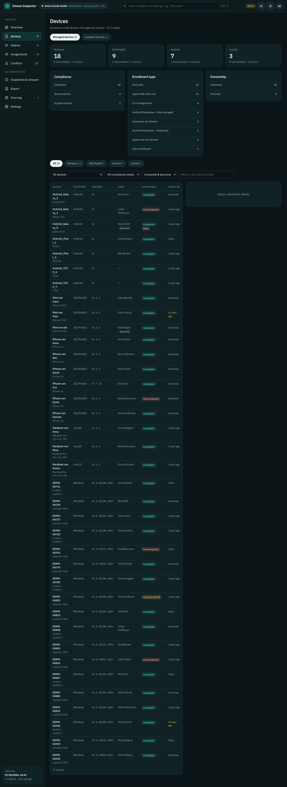
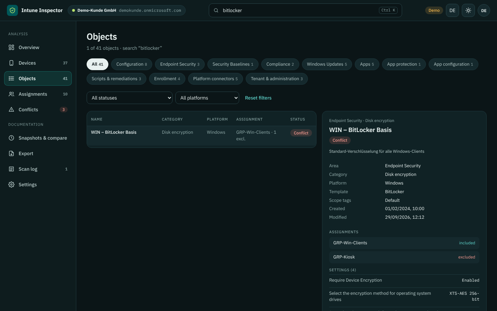
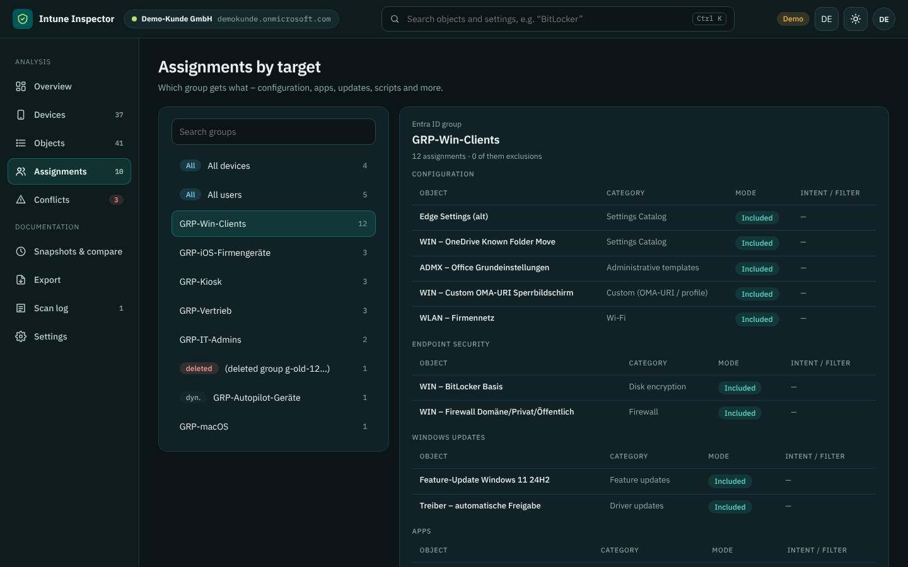
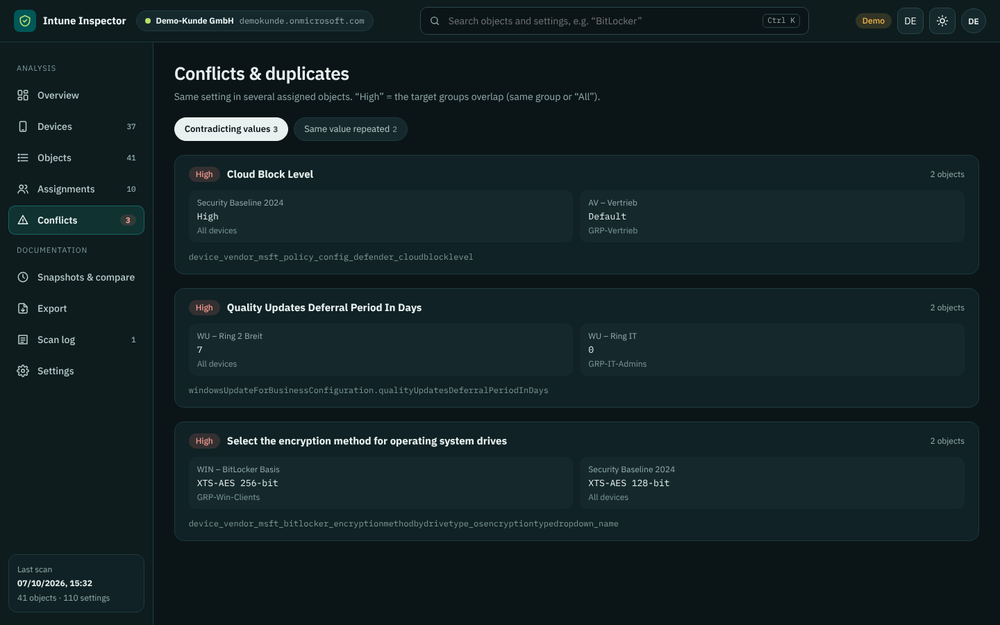
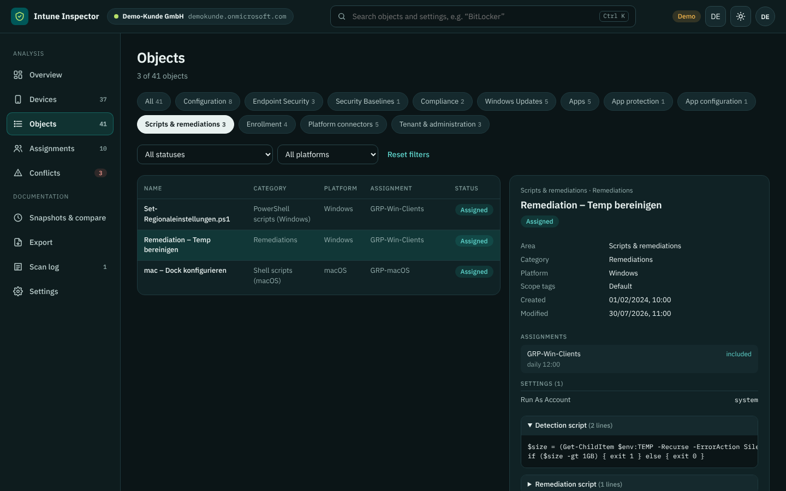
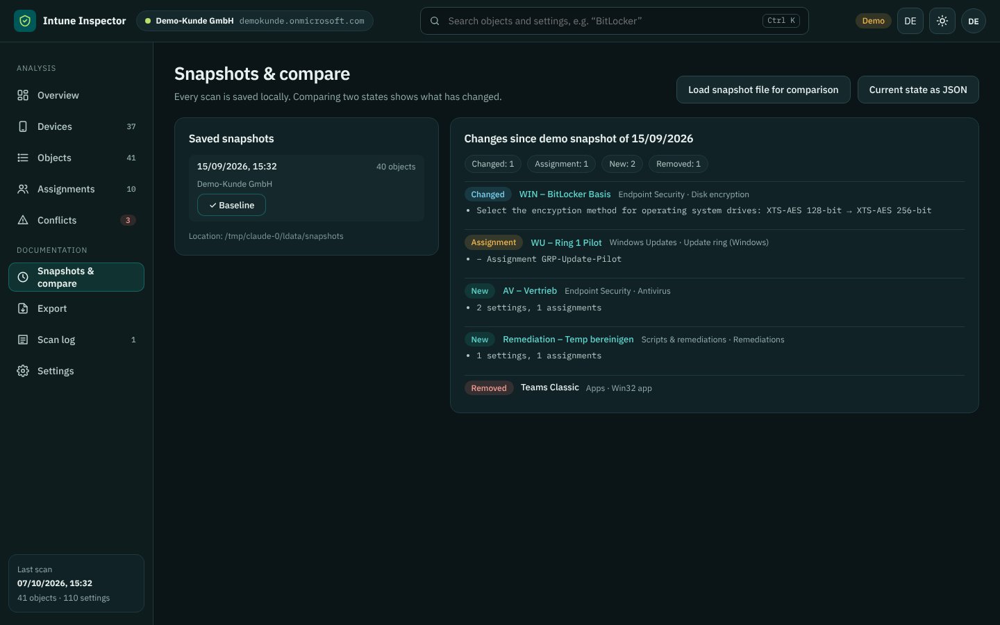
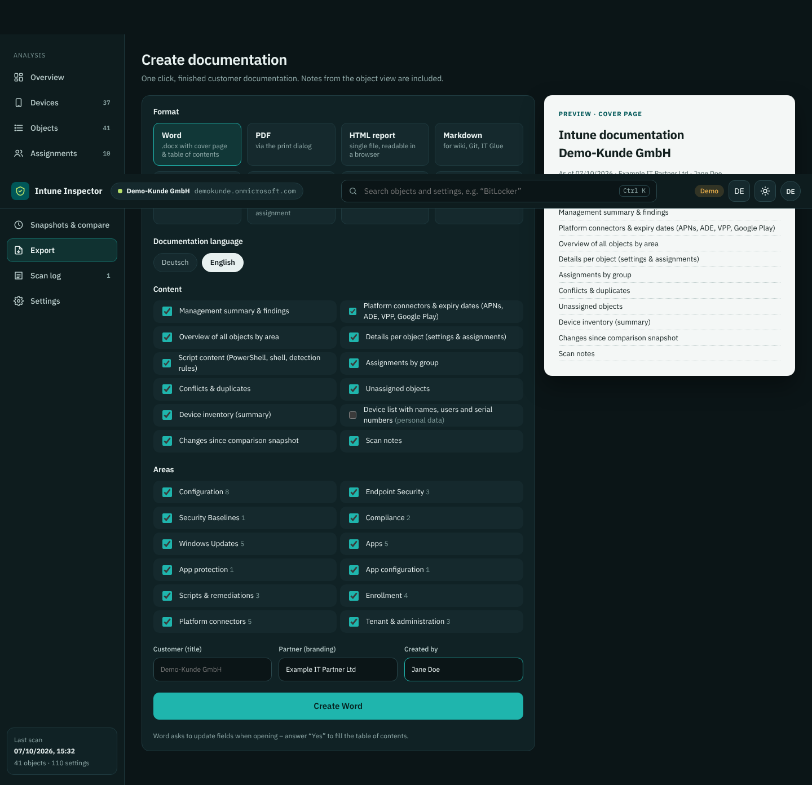
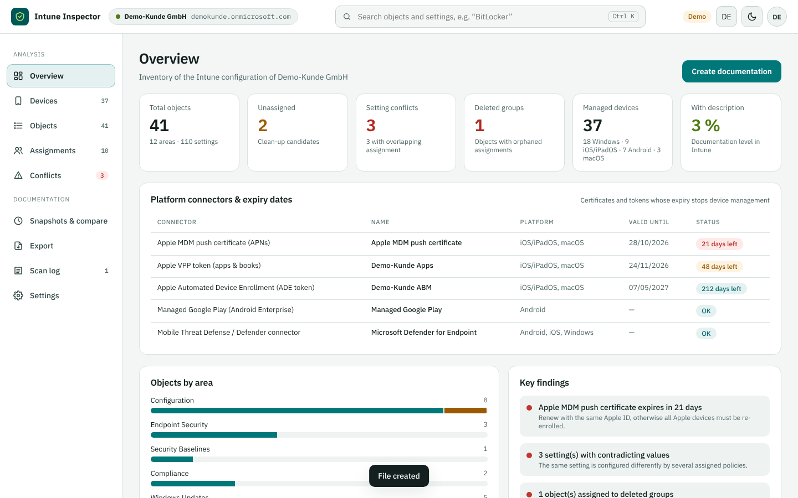
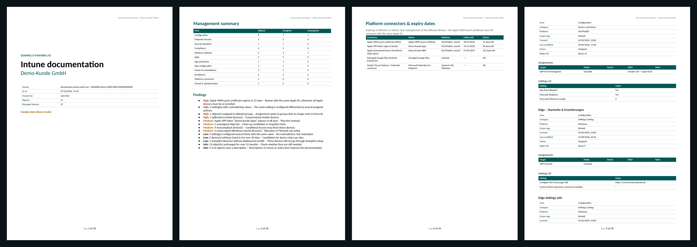

<div align="center">

# Intune Inspector

**Capture, understand and document an entire Microsoft Intune environment in minutes.**
Double-click, sign in to the customer tenant, done – no PowerShell, no installation, read-only.

🇬🇧 English · 🇩🇪 [Deutsch](README.md)


</div>

---

## What is it for?

After a change of IT provider, a takeover or for an audit, the same question always comes up: *Which Intune policies exist, what do they do, and who gets what?* Intune Inspector answers it automatically:

- reads **all** Intune configuration of a tenant via Microsoft Graph – strictly read-only,
- normalizes it (settings, assignments, filters, scripts),
- finds **conflicts, clean-up candidates and expiring certificates**,
- captures the **device inventory** for all platforms including Windows Autopilot,
- and creates a **finished customer documentation** with one click (Word, PDF, HTML, Markdown, Excel/CSV, JSON).

Technically it is a single executable: it starts a small web server reachable only on `localhost` and opens the interface in your browser. Sign-in and queries go directly from the browser to Microsoft Entra ID and Microsoft Graph. There is no cloud service in between and no data is sent to third parties.

## Features

| | |
| --- | --- |
| **Complete read-only scan** | Settings catalog, configuration profiles, ADMX, OMA-URI, endpoint security, security baselines, compliance, update rings & Windows update profiles, apps, app protection, app configuration, scripts & remediations, enrollment & Autopilot, filters, scope tags, roles |
| **Device inventory** | Windows, iOS/iPadOS, Android, macOS with version, model, user, ownership, compliance, enrollment type, encryption, last check-in – plus all Windows Autopilot devices |
| **Platform connectors** | Apple MDM push certificate, ADE and VPP tokens with remaining validity, Managed Google Play, Defender for Endpoint / MTD |
| **Analysis** | Conflicts & duplicates with target-group overlap rating, assignments by group, unassigned objects, assignments to deleted groups, stale objects, noncompliant or inactive devices |
| **Snapshots & compare** | Every scan is saved locally; comparing two states shows what changed |
| **One-click documentation** | Word with cover page, table of contents and page numbers, PDF, HTML, Markdown, CSV, JSON backup – with partner branding and your own notes per object |
| **German & English** | Switch the interface with one click; create the documentation in either language independently |
| **Secure by design** | Read-only Graph calls, `localhost` only, strict Content Security Policy, secrets (passwords, PSKs, tokens) are hidden |

## Screenshots

<table>
<tr>
<td width="50%"><br><sub><b>Device inventory</b> – all platforms, versions, enrollment types, compliance</sub></td>
<td width="50%"><br><sub><b>Search across all settings</b> – e.g. “BitLocker”, with detail view</sub></td>
</tr>
<tr>
<td><br><sub><b>Assignments by group</b> – who gets what, including deleted groups</sub></td>
<td><br><sub><b>Conflicts</b> – same setting, different values</sub></td>
</tr>
<tr>
<td><br><sub><b>Scripts & remediations</b> – including script content and schedule</sub></td>
<td><br><sub><b>Snapshot compare</b> – changes between two scans</sub></td>
</tr>
<tr>
<td><br><sub><b>Export</b> – format, language, content and areas selectable</sub></td>
<td><br><sub><b>Light theme</b> – switchable</sub></td>
</tr>
</table>

**Result – Word export (excerpt):**



Complete sample documents from the demo tenant: [Word](docs/sample/Sample-Documentation.docx) · [PDF](docs/sample/Sample-Documentation.pdf) · [HTML](docs/sample/Sample-Documentation.html) · [Markdown](docs/sample/Sample-Documentation.md)

## Quick start

1. Download the file for your system from the [releases page](../../releases) and unzip it.
2. Double-click `IntuneInspector.exe` (macOS/Linux: `chmod +x IntuneInspector && ./IntuneInspector`).
3. On first start, enter the **client ID** of an app registration (one-time, see below).
4. Enter the customer tenant, **Sign in with Microsoft** – the scan starts automatically.

> Try it without a tenant: choose **“Demo with sample data”** on the sign-in page or open `http://localhost:8400/?demo&lang=en`.

> **Windows SmartScreen:** the executable is not signed. On first start choose *More info → Run anyway*, or unblock the ZIP first (right-click → *Properties* → *Unblock*). **macOS:** right-click → *Open* on first start.

## One-time setup

Create the app registration once (e.g. in your own partner tenant); it works for any number of customer tenants.

1. **Entra admin center → Identity → Applications → App registrations → New registration**
   - Name: `Intune Inspector`
   - Supported account types: **Accounts in any organizational directory (multitenant)**
2. **Authentication → Add a platform → Single-page application (SPA)**
   - Redirect URI: `http://localhost:8400/redirect.html`
   - Important: *SPA*, not *Web*. No client secret or certificate is needed.
3. **API permissions → Add a permission → Microsoft Graph → Delegated permissions** (all read-only):

   | Permission | Used for |
   | --- | --- |
   | `DeviceManagementConfiguration.Read.All` | Configuration profiles, settings catalog, endpoint security, baselines, compliance, update profiles |
   | `DeviceManagementApps.Read.All` | Apps, app protection, app configuration, VPP tokens |
   | `DeviceManagementServiceConfig.Read.All` | Enrollment, Autopilot, ESP, filters, APNs, ADE, Managed Google Play, MTD, branding |
   | `DeviceManagementManagedDevices.Read.All` | Device inventory, device categories |
   | `DeviceManagementRBAC.Read.All` | Intune roles and scope tags |
   | `DeviceManagementScripts.Read.All` | PowerShell and shell scripts, remediations, compliance scripts |
   | `Group.Read.All` | Resolve names of assigned groups |
   | `User.Read` | Sign-in, tenant name |

4. Copy the **Application (client) ID** and enter it in Intune Inspector on first start.

### Admin consent in the customer tenant

Grant admin consent once per customer tenant – either an administrator ticks *Consent on behalf of your organization* during sign-in, or use the link
`https://login.microsoftonline.com/<CUSTOMER-TENANT>/adminconsent?client_id=<CLIENT-ID>` (Intune Inspector also shows it automatically on a consent error).

### Partner access (GDAP)

- Always enter the **customer tenant** on the sign-in page; otherwise Entra ID signs you in to your home tenant.
- Reading requires e.g. the GDAP role **Intune Administrator** or **Global Reader**; granting consent requires **Cloud Application Administrator** (or the customer consents).

### Distributing to colleagues

Place a `config.json` next to `IntuneInspector.exe` (template: `config.json.beispiel`):

```json
{ "clientId": "00000000-0000-0000-0000-000000000000", "brandLabel": "Your team name" }
```

It is picked up on first start and the setup page is skipped. `brandLabel` is the optional subtitle below the logo.

### Command-line options

```
IntuneInspector.exe -port 8401      different port (add the matching redirect URI!)
IntuneInspector.exe -no-browser     do not open the browser automatically
IntuneInspector.exe -data D:\Docs   different data folder
```

## Language

Switch between German and English with the **EN/DE** button in the header, on the sign-in page or under *Settings*. The initial language follows your browser and your choice is remembered. On the *Export* page the documentation language can be chosen independently – e.g. work in German, deliver an English document. Content from the tenant (policy names, descriptions, group names, Graph setting names) is not translated.

## Data & privacy

- Everything is stored in the **`IntuneInspector-Daten`** folder next to the executable: `config.json`, `snapshots/` (one JSON per scan – contains the full tenant configuration and the device inventory, treat as confidential) and `notes/`.
- Tokens live only in the browser's session storage. There is no telemetry.
- Secrets are hidden on read and never reach snapshots or exports.
- The personal **device list** (names, users, serial numbers) is **deselected by default** in exports; the document then only contains aggregated figures.

## Troubleshooting

| Message | Fix |
| --- | --- |
| `AADSTS50011` (redirect URI) | Add `http://localhost:8400/redirect.html` as **SPA** redirect URI |
| `AADSTS9002326` / cross-origin | The URI is registered as *Web* instead of *SPA* |
| `AADSTS700016` | App is not multitenant or the client ID is wrong |
| `AADSTS65001` / consent required | Grant admin consent in the customer tenant (link above) |
| Pop-up blocked | Allow pop-ups for `localhost` |
| “Access denied (403)” in the scan log | Graph permission missing, consent outdated (re-consent after adding permissions) or account lacks an Intune role |
| Port already in use | Is the tool already running? Otherwise use `-port` |

## Documentation

Detailed documentation is currently available in German:
[Setup](docs/einrichtung.md) · [Usage](docs/bedienung.md) · [Data scope](docs/datenumfang.md) · [Export](docs/export.md) · [Security & privacy](docs/sicherheit-datenschutz.md) · [Troubleshooting](docs/fehlerbehebung.md) · [Development](docs/entwicklung.md) · [Release checklist](docs/veroeffentlichung.md) · [Changelog](CHANGELOG.md)

## Requirements

- Windows 10/11 (x64 or ARM64), macOS 12+ (Apple silicon or Intel) or Linux x64
- A current browser (Edge, Chrome, Firefox, Safari)
- An account with read access to Intune in the target tenant (e.g. *Global Reader* or *Intune Administrator*, also via GDAP)

## Status

Version 1.2.1. Logic, interface and exports are tested with demo data and against a simulated Graph API in both languages. A first test against a real demo tenant was successful; further tests (e.g. via GDAP against customer tenants) are pending – see the [release checklist](docs/veroeffentlichung.md).

## License

[MIT](LICENSE) – free to use, modify and redistribute, including commercially; provided without warranty. Third-party components and their licenses: [THIRD_PARTY_NOTICES.md](THIRD_PARTY_NOTICES.md).

Microsoft, Intune, Entra and Windows are trademarks of the Microsoft group of companies. This project is not affiliated with Microsoft.
