# Bedienung

Ein Rundgang durch alle Ansichten. Alle Screenshots stammen aus dem **Demo-Modus** (fiktiver Mandant „Demo-Kunde GmbH“), der sich auf der Anmeldeseite oder über `http://localhost:8400/?demo` starten lässt.

## Ablauf

1. **Anmelden** – Kundentenant eintragen, *Mit Microsoft anmelden*.
2. **Scan** – alle Bereiche werden nacheinander gelesen; der Fortschritt ist je Quelle sichtbar. Bereiche, die im Mandanten nicht lizenziert sind oder für die Rechte fehlen, werden übersprungen und im Scan-Protokoll vermerkt.
3. **Analysieren** – Übersicht, Geräte, Objekte, Zuweisungen, Konflikte.
4. **Notizen ergänzen** – zu jedem Objekt (Zweck, Ansprechpartner, Ticket).
5. **Exportieren** – Dokumentation im gewünschten Format.

Jeder Scan wird automatisch als Snapshot gespeichert. **Neu scannen** ist jederzeit über die Seitenleiste möglich.

## Übersicht

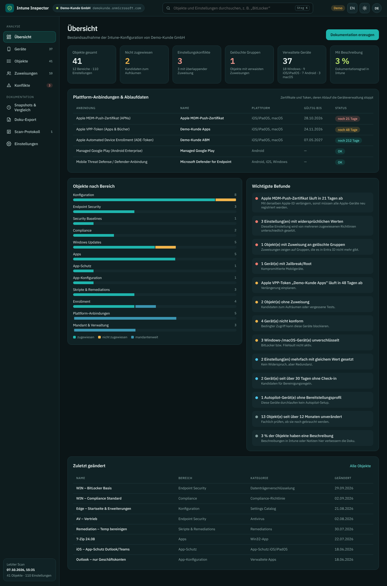

- **Kennzahlen:** Objekte, nicht zugewiesene Objekte, Konflikte, Zuweisungen an gelöschte Gruppen, verwaltete Geräte, Dokumentationsgrad. Jede Kachel führt per Klick zur gefilterten Liste.
- **Plattform-Anbindungen & Ablaufdaten:** APNs-Zertifikat, ADE- und VPP-Token mit Restlaufzeit; Managed Google Play und Defender-Anbindung mit Status.
- **Objekte nach Bereich:** zugewiesen / nicht zugewiesen / mandantenweit.
- **Wichtigste Befunde:** nach Schwere sortiert (Hoch, Mittel, Niedrig, Info), jeweils klickbar.

## Geräte

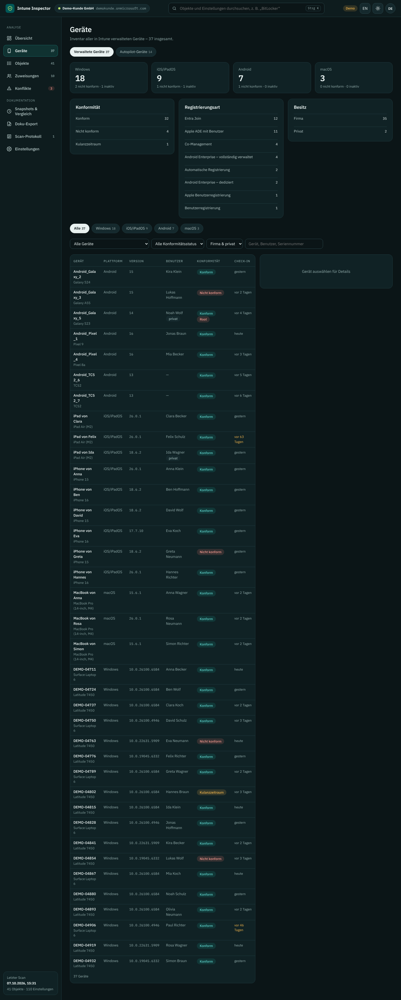

- Kacheln je Plattform (Windows, iOS/iPadOS, Android, macOS) mit nicht konformen und inaktiven Geräten.
- Verteilung von **Betriebssystem-Versionen**, **Registrierungsart** und – bei Windows – **Join-Typ** (Entra Join, Hybrid, Co-Management).
- Filter nach Plattform, Auffälligkeit (nicht konform, Kulanzzeitraum, > 30 Tage ohne Check-in, unverschlüsselt, Jailbreak/Root, Privatgeräte), Konformität und Besitz sowie freie Suche nach Gerät, Benutzer oder Seriennummer.

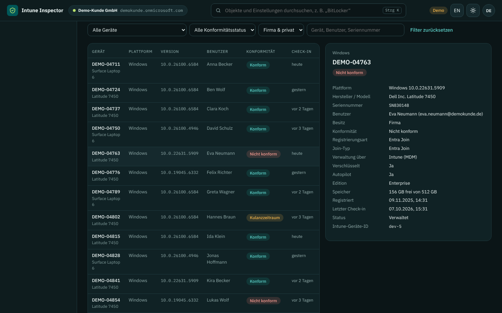

Der Reiter **Autopilot-Geräte** zeigt die bei Windows Autopilot registrierte Hardware – auch Geräte, die noch nicht ausgerollt sind – mit Group Tag, Status und Bereitstellungsprofil:

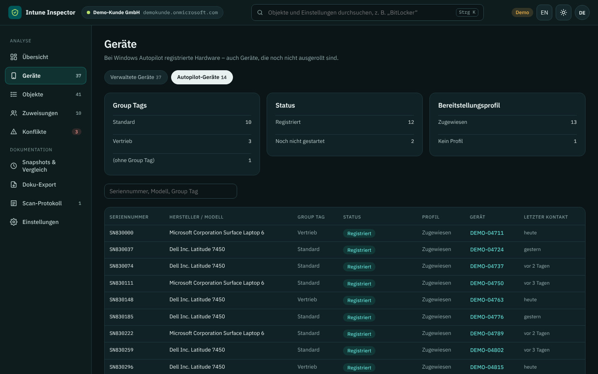

## Objekte

Alle Richtlinien, Profile, Apps, Skripte und Einstellungen in einer Liste.

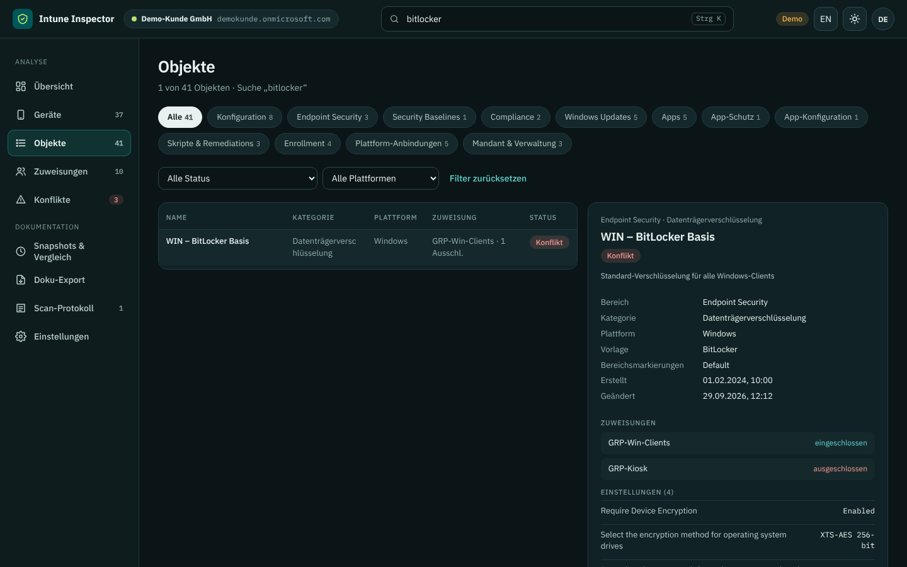

- **Bereichs-Filter** oben, darunter Status (zugewiesen, nicht zugewiesen, mit Konflikt, gelöschte Gruppe, Ein- und Ausschluss derselben Gruppe, doppelter Name, > 12 Monate unverändert) und Plattform.
- Die **Suche** (`Strg+K`) durchsucht Namen, Einstellungen *und deren Werte*, Zuweisungen, Skriptinhalte und Notizen. Bei Treffern in Einstellungen wird die Fundstelle unter dem Namen angezeigt.
- **Detailansicht:** Eigenschaften, Zuweisungen (eingeschlossen/ausgeschlossen, Filter, Absicht bei Apps, Zeitplan bei Remediations), alle konfigurierten Einstellungen (filterbar), Skriptinhalte, Notizfeld und Rohdaten (JSON).

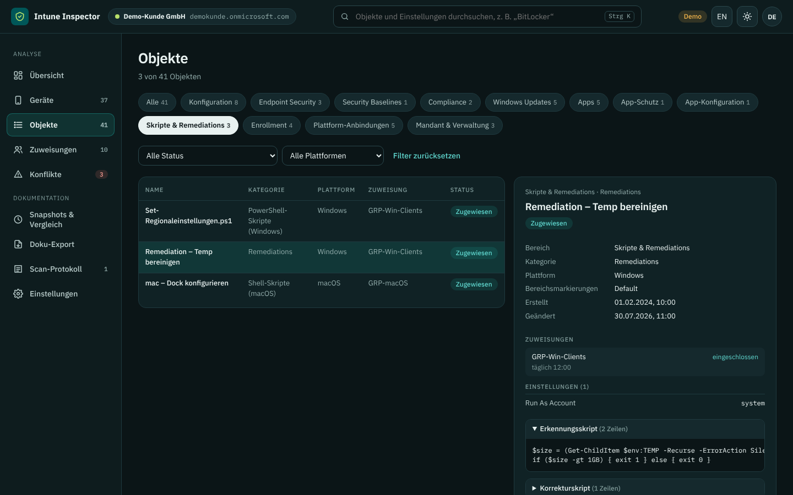

Notizen werden automatisch je Mandant gespeichert (`IntuneInspector-Daten/notes`) und in den Export übernommen.

## Zuweisungen

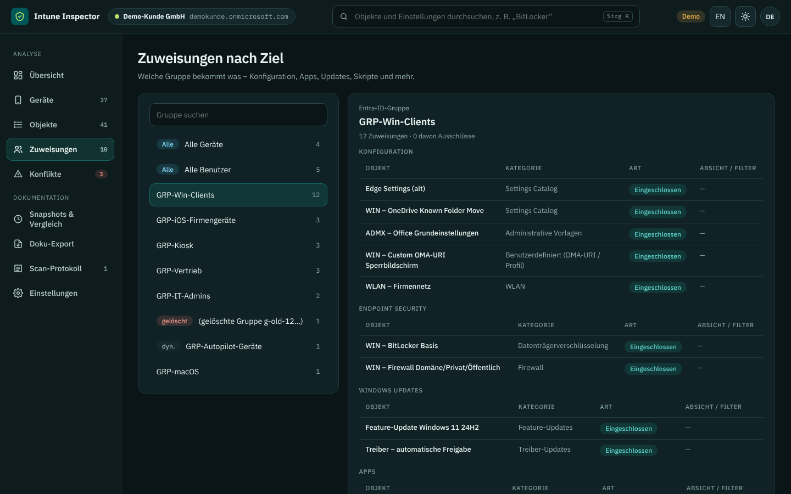

Die Sicht „von der Gruppe aus“: Für jede Gruppe sowie *Alle Geräte* und *Alle Benutzer* steht, welche Konfigurationen, Apps, Updates und Skripte sie bekommt – getrennt nach Bereich, mit Ausschlüssen und Filtern. Dynamische und gelöschte Gruppen sind markiert.

## Konflikte

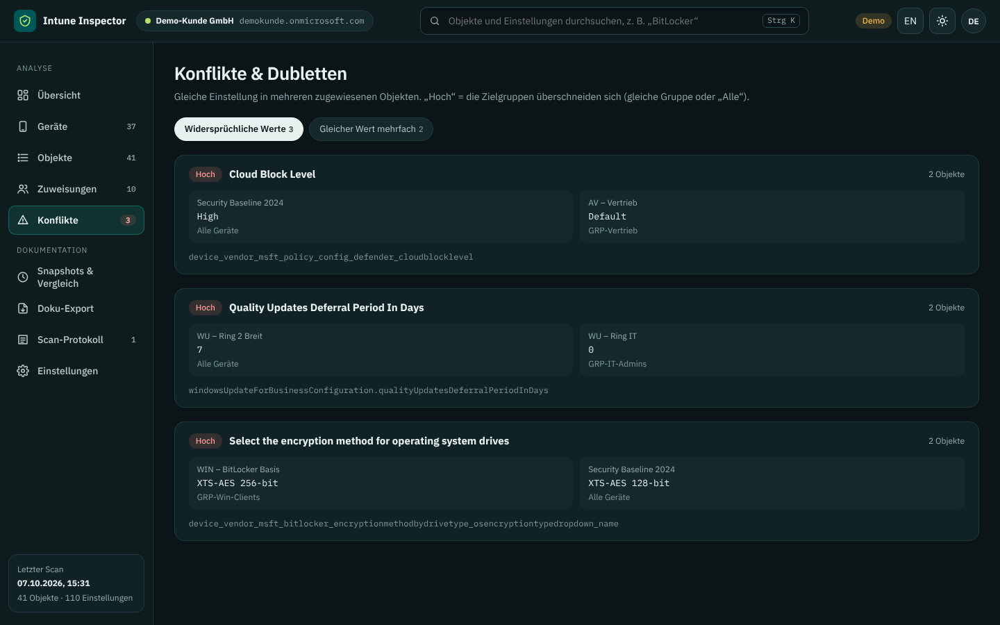

- **Widersprüchliche Werte:** dieselbe Einstellung in mehreren zugewiesenen Richtlinien mit unterschiedlichem Wert.
  - *Hoch* – die Zielgruppen überschneiden sich (gleiche Gruppe oder „Alle Geräte/Benutzer“).
  - *Prüfen* – keine direkte Überschneidung erkennbar; dynamische Gruppen oder Verschachtelungen können trotzdem überlappen.
- **Gleicher Wert mehrfach:** kein Widerspruch, aber Redundanz.

Verglichen werden Einstellungen gleicher Herkunft (z. B. Settings Catalog untereinander, Update-Ringe untereinander).

## Snapshots & Vergleich

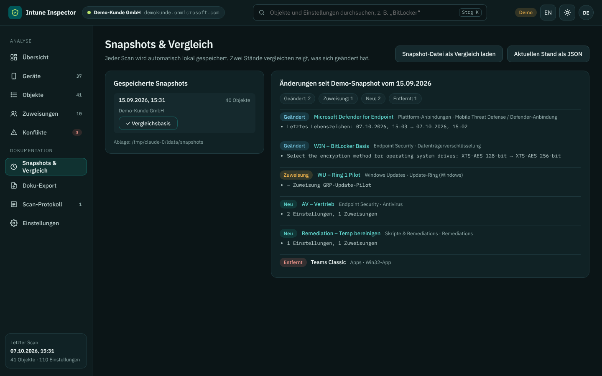

- Liste aller gespeicherten Scans dieses Mandanten.
- **Vergleichen** zeigt neue, geänderte und entfernte Objekte sowie geänderte Zuweisungen – bis auf Einstellungsebene („Verschlüsselung XTS-AES 128 → 256“).
- **Ansehen** öffnet einen alten Stand schreibgeschützt.
- **Snapshot-Datei laden** vergleicht mit einer JSON-Datei, z. B. von einem Kollegen.
- Entfernte Snapshots landen in `snapshots/_entfernt` und werden nicht gelöscht.

## Doku-Export

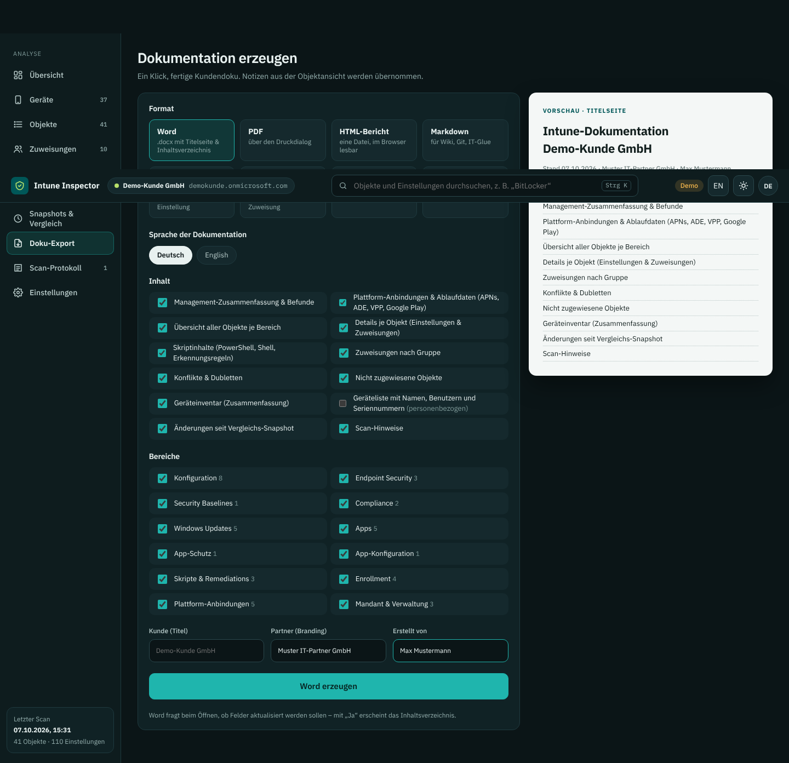

Format, Inhalt und Bereiche wählen, Kunde/Partner/Autor eintragen, erzeugen. Details: [Export](export.md).

## Scan-Protokoll und Einstellungen

- **Scan-Protokoll:** welche Quellen wie viele Objekte geliefert haben und wo Rechte fehlten oder ein Bereich nicht lizenziert ist.
- **Einstellungen:** Client-ID, Standard-Tenant, Untertitel/Branding, Umleitungs-URI zum Kopieren, Berechtigungsliste, helles/dunkles Design.

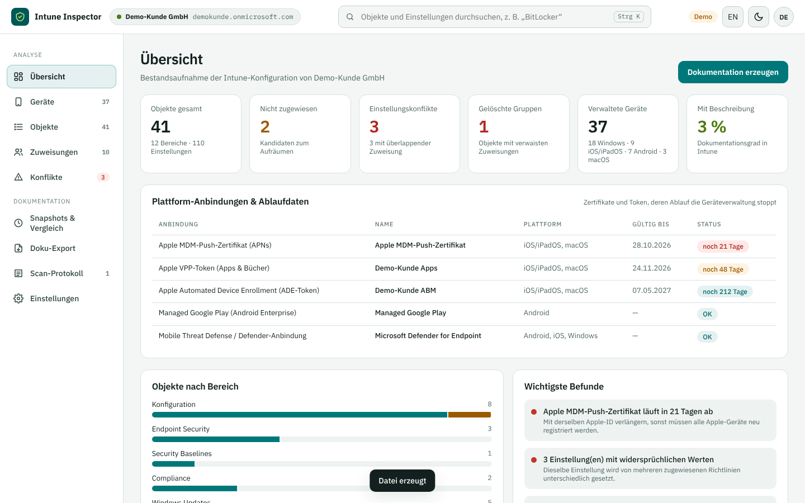

## Sprache

Die Oberfläche gibt es auf **Deutsch und Englisch**. Umschalten über die Schaltfläche **EN/DE** in der Kopfzeile, auf der Anmeldeseite oder unter *Einstellungen*. Beim ersten Start richtet sich die Sprache nach dem Browser; die Wahl wird gemerkt. Direktaufruf: `http://localhost:8400/?lang=en`.

Übersetzt werden alle Texte des Tools, Bereiche, Kategorien, Befunde und Vergleiche. **Nicht** übersetzt werden Inhalte aus dem Mandanten – Richtliniennamen, Beschreibungen, Gruppennamen – sowie die Namen der Einstellungen, die Microsoft Graph liefert (meist englisch).

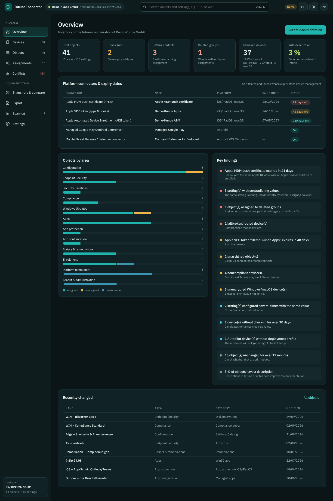

## Tastatur

| Taste | Wirkung |
| --- | --- |
| `Strg+K` / `⌘K` | Suche fokussieren |
| `Esc` (in der Suche) | Suche leeren |
| `Enter` (Anmeldeseite) | Anmelden |
