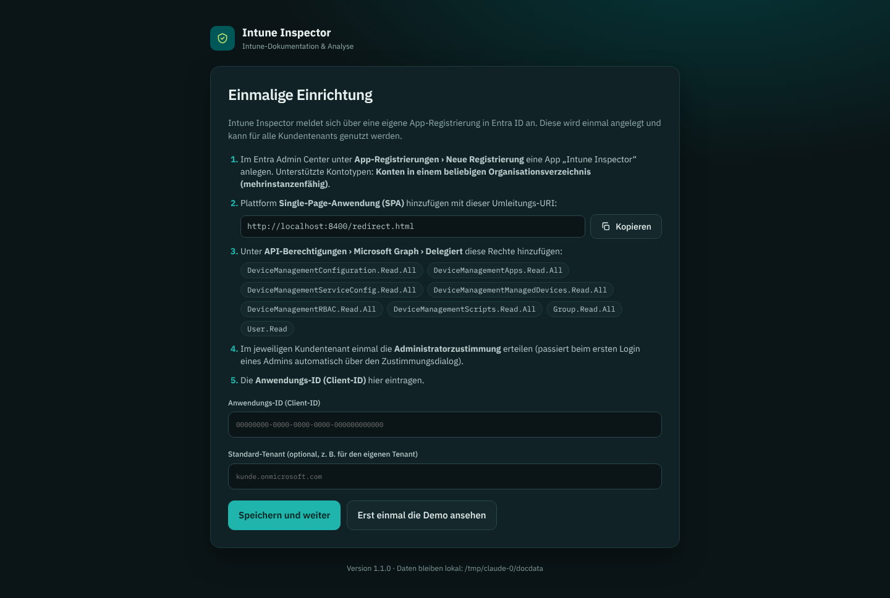
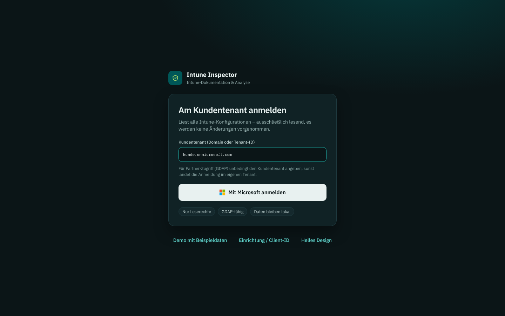

# Einrichtung

Intune Inspector braucht genau eine Sache: eine **App-Registrierung in Microsoft Entra ID**. Sie wird einmal angelegt (z. B. im eigenen Partner-Tenant) und kann danach für beliebig viele Kundentenants genutzt werden.



## 1. App-Registrierung anlegen

1. [Entra Admin Center](https://entra.microsoft.com) öffnen → **Identität → Anwendungen → App-Registrierungen → Neue Registrierung**.
2. Name: `Intune Inspector` (frei wählbar, erscheint im Zustimmungsdialog).
3. **Unterstützte Kontotypen:** *Konten in einem beliebigen Organisationsverzeichnis (beliebiger Microsoft Entra ID-Mandant – mehrinstanzenfähig)*.
   Nur so funktioniert die Anmeldung in Kundentenants.
4. Umleitungs-URI jetzt leer lassen → **Registrieren**.

## 2. Plattform „Single-Page-Anwendung“ hinzufügen

1. In der App → **Authentifizierung → Plattform hinzufügen → Single-Page-Anwendung**.
2. Umleitungs-URI: **`http://localhost:8400/redirect.html`**
3. Speichern.

> Wichtig: als **SPA**, nicht als *Web*. Bei „Web“ schlägt die Anmeldung mit `AADSTS9002326` fehl.
> Wer einen anderen Port verwenden will (siehe [Startoptionen](#startoptionen)), trägt zusätzlich `http://localhost:<PORT>/redirect.html` ein.

Ein Client-Geheimnis oder Zertifikat wird **nicht** benötigt – die App ist ein öffentlicher Client mit PKCE.

## 3. API-Berechtigungen

**API-Berechtigungen → Berechtigung hinzufügen → Microsoft Graph → Delegierte Berechtigungen**:

| Berechtigung | Wofür |
| --- | --- |
| `DeviceManagementConfiguration.Read.All` | Konfigurationsprofile, Settings Catalog, Endpoint Security, Baselines, Compliance, Update-Profile |
| `DeviceManagementApps.Read.All` | Apps, App-Schutz, App-Konfiguration, VPP-Token |
| `DeviceManagementServiceConfig.Read.All` | Enrollment, Autopilot, ESP, Filter, APNs, ADE, Managed Google Play, MTD, Branding |
| `DeviceManagementManagedDevices.Read.All` | Geräteinventar, Gerätekategorien |
| `DeviceManagementRBAC.Read.All` | Intune-Rollen und Bereichsmarkierungen |
| `DeviceManagementScripts.Read.All` | PowerShell- und Shell-Skripte, Remediations, Compliance-Skripte |
| `Group.Read.All` | Namen der zugewiesenen Gruppen auflösen |
| `User.Read` | Anmeldung, Mandantenname |

Alle Berechtigungen sind **nur lesend**. Intune Inspector fordert beim Login den Bereich `https://graph.microsoft.com/.default` an, also genau die Rechte, die hier eingetragen und zugestimmt wurden.

## 4. Client-ID eintragen

Auf der Übersichtsseite der App die **Anwendungs-ID (Client-ID)** kopieren und beim ersten Start in Intune Inspector eintragen. Sie wird in `IntuneInspector-Daten/config.json` gespeichert und lässt sich später unter *Einstellungen* ändern.

## 5. Administratorzustimmung im Kundentenant

Weil Intune-Leserechte eine Administratorzustimmung erfordern, muss pro Kundentenant einmal zugestimmt werden:

- **Variante A:** Ein Administrator des Kunden meldet sich in Intune Inspector an und setzt im Dialog den Haken *Im Namen Ihrer Organisation zustimmen*.
- **Variante B:** Zustimmungslink direkt aufrufen:
  ```
  https://login.microsoftonline.com/<KUNDENTENANT>/adminconsent?client_id=<CLIENT-ID>
  ```
  Intune Inspector zeigt diesen Link bei einem Zustimmungsfehler auch automatisch an.

Werden später Berechtigungen ergänzt (z. B. bei einem Update), muss erneut zugestimmt werden.

## Anmeldung über GDAP (Partner)



- Auf der Anmeldeseite **immer den Kundentenant** (Domain oder Tenant-ID) eintragen. Ohne Angabe meldet Entra ID im Heimat-Tenant des Kontos an.
- Lesen: GDAP-Rolle **Intune-Administrator** oder **Globaler Leser** genügt.
- Zustimmung: Rolle **Cloudanwendungsadministrator** (oder der Kunde stimmt selbst zu).
- Der Zugriff ist durch die GDAP-Rolle begrenzt: Was die Rolle nicht lesen darf, erscheint im *Scan-Protokoll* als „Keine Berechtigung (403)“.

## Verteilung an Kollegen

Damit Kollegen die Einrichtungsseite nicht sehen, neben die `IntuneInspector.exe` eine `config.json` legen (Vorlage: `config.json.beispiel`):

```json
{
  "clientId": "00000000-0000-0000-0000-000000000000",
  "defaultTenant": "",
  "brandLabel": "Name des Teams"
}
```

Sie wird beim ersten Start in den Datenordner übernommen. `brandLabel` ist der Untertitel unter dem Logo (optional).

## Startoptionen

```
IntuneInspector.exe                   Standard: Port 8400, Browser öffnen
IntuneInspector.exe -port 8401        anderer Port (Umleitungs-URI ergänzen!)
IntuneInspector.exe -no-browser       Browser nicht automatisch öffnen
IntuneInspector.exe -data D:\Doku     anderer Datenordner
```

Der Port kann auch dauerhaft in der `config.json` stehen (`"port": 8401`).

## Windows SmartScreen

Die Programmdatei ist nicht signiert. Beim ersten Start meldet Windows ggf. „Der Computer wurde durch Windows geschützt“ → **Weitere Informationen → Trotzdem ausführen**. Alternativ vor dem Entpacken Rechtsklick auf die ZIP → *Eigenschaften* → *Zulassen*. Für eine breite Verteilung empfiehlt sich eine Code-Signatur (siehe [Veröffentlichung](veroeffentlichung.md)).

## macOS und Linux

```sh
chmod +x IntuneInspector-macOS-AppleSilicon     # bzw. -macOS-Intel / -Linux
./IntuneInspector-macOS-AppleSilicon
```

macOS blockiert unsignierte Programme beim ersten Start: Rechtsklick → **Öffnen** oder
`xattr -d com.apple.quarantine IntuneInspector-macOS-AppleSilicon`.

## Beenden

Konsolenfenster schließen oder `Strg+C`. Die Anmeldung gilt nur für die Browser-Sitzung (Session Storage) und wird beim Abmelden bzw. Schließen des Browsers verworfen.
