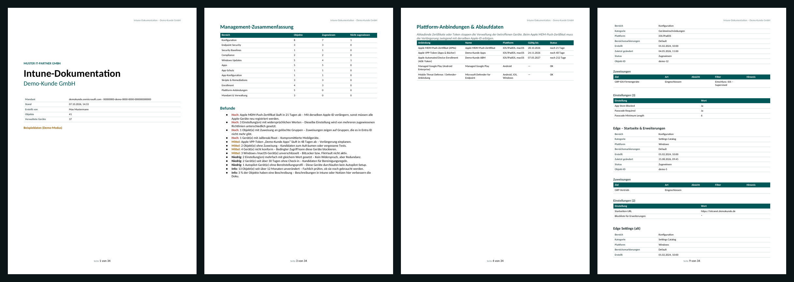

# Export

## Formate

| Format | Ergebnis | Hinweise |
| --- | --- | --- |
| **Word** | `.docx` mit Titelseite, Inhaltsverzeichnis, Kopf-/Fußzeile und Seitenzahlen | Word fragt beim Öffnen, ob Felder aktualisiert werden sollen – mit **Ja** wird das Inhaltsverzeichnis gefüllt. |
| **PDF** | über den Druckdialog des Browsers | Ziel „Als PDF speichern“ bzw. „Microsoft Print to PDF“ wählen. Layout für A4 optimiert. |
| **HTML-Bericht** | eine eigenständige `.html`-Datei | ohne externe Abhängigkeiten, im Browser les- und druckbar |
| **Markdown** | `.md` | für Wikis, Git, IT-Glue, Hudu, Confluence-Import |
| **Excel: Einstellungen** | `.csv`, eine Zeile je Einstellung | Semikolon-getrennt, UTF-8 mit BOM – öffnet direkt korrekt in deutschem Excel |
| **Excel: Zuweisungen** | `.csv`, eine Zeile je Zuweisung | inkl. nicht zugewiesener Objekte |
| **Excel: Geräte** | `_Geraete.csv` und `_Autopilot.csv` | vollständiges Inventar |
| **JSON-Backup** | kompletter Snapshot | Rohdaten aller Objekte; lässt sich später als Vergleichsbasis laden |

Beispiele aus dem Demo-Mandanten: [Word](beispiel/Beispiel-Dokumentation.docx) · [PDF](beispiel/Beispiel-Dokumentation.pdf) · [HTML](beispiel/Beispiel-Dokumentation.html) · [Markdown](beispiel/Beispiel-Dokumentation.md)

## Abschnitte

| Abschnitt | Inhalt | Standard |
| --- | --- | --- |
| Management-Zusammenfassung & Befunde | Objekte je Bereich, alle Befunde nach Schwere | an |
| Plattform-Anbindungen & Ablaufdaten | APNs, ADE, VPP, Managed Google Play, MTD mit Restlaufzeit | an |
| Übersicht aller Objekte je Bereich | Tabelle: Name, Kategorie, Plattform, Zuweisung, Änderungsdatum | an |
| Details je Objekt | Eigenschaften, Notiz, Zuweisungen, alle Einstellungen | an |
| Skriptinhalte | PowerShell/Shell, Erkennungs- und Korrekturskripte, Erkennungsregeln | an |
| Zuweisungen nach Gruppe | je Gruppe alle Objekte mit Art, Absicht, Filter | an |
| Konflikte & Dubletten | je Einstellung die beteiligten Richtlinien und Werte | an |
| Nicht zugewiesene Objekte | Aufräum-Kandidaten | an |
| Geräteinventar (Zusammenfassung) | Geräte je Plattform, Konformität, Registrierungsart, Join-Typ, OS-Versionen, Modelle, Autopilot-Group-Tags | an |
| **Geräteliste mit Namen, Benutzern und Seriennummern** | jedes Gerät einzeln, Autopilot-Liste | **aus** |
| Änderungen seit Vergleichs-Snapshot | nur verfügbar, wenn unter *Snapshots* ein Vergleich gewählt ist | automatisch an, sobald gewählt |
| Scan-Hinweise | übersprungene Bereiche, fehlende Rechte | an |

Zusätzlich lassen sich einzelne **Bereiche** (z. B. nur Apps und Updates) für den Export auswählen.

## Datenschutz bei der Geräteliste

Die Geräteliste enthält personenbezogene Daten (Benutzernamen, UPNs, Gerätenamen, Seriennummern) und ist deshalb standardmäßig abgewählt. Ohne sie enthält die Doku nur zusammengefasste Zahlen. Wer sie benötigt (z. B. für eine Inventarübergabe), setzt unter *Inhalt* den Haken und gibt das Dokument nur an berechtigte Empfänger weiter. Die CSV „Excel: Geräte“ enthält diese Daten immer.

## Branding

- **Kunde (Titel):** überschreibt den Mandantennamen auf der Titelseite.
- **Partner:** erscheint als Kopfzeile auf der Titelseite (z. B. der betreuende IT-Dienstleister).
- **Erstellt von:** Name auf der Titelseite.

Partner und Autor werden im Browser gemerkt.

## Dateinamen

`Intune-Doku_<Kunde>_<JJJJ-MM-TT>.<endung>` – das Datum ist das Scan-Datum.
